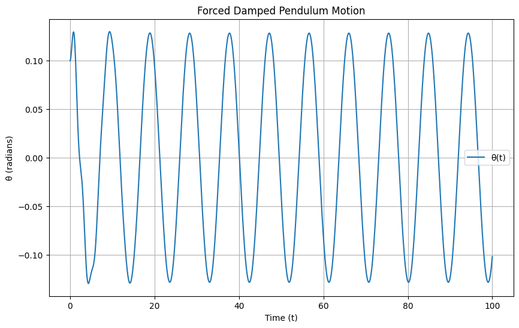
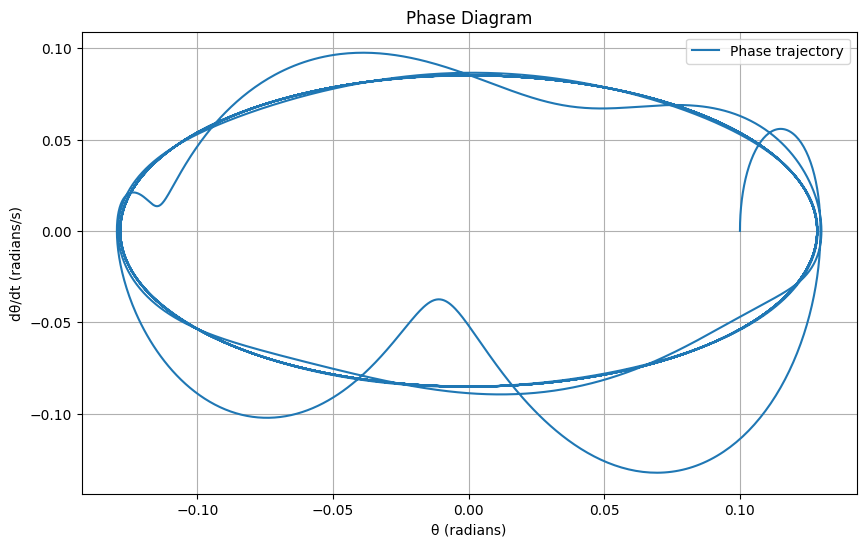
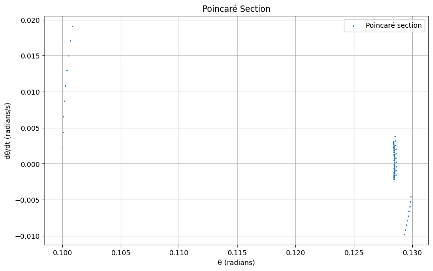
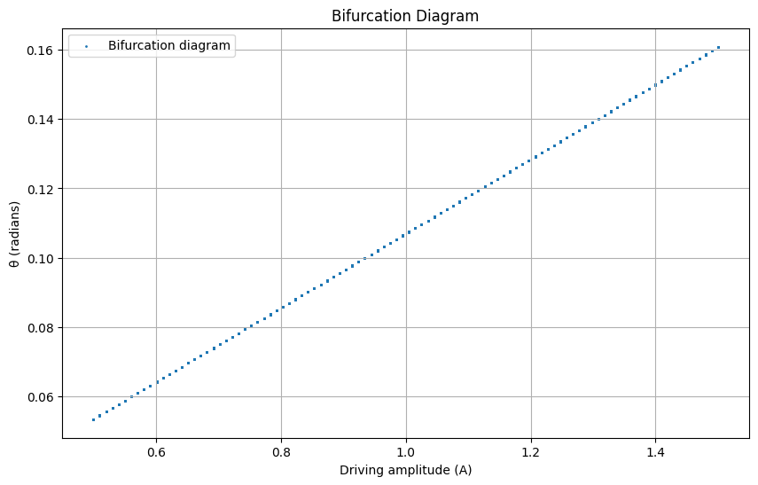

# Problem 2 
Investigating the Dynamics of a Forced Damped Pendulum
Motivation

The forced damped pendulum is a fascinating system that evolves from simple harmonic motion to complex dynamics due to the interplay of damping, gravitational restoring forces, and external periodic forcing. 

This system exhibits behaviors such as resonance, quasiperiodicity, and chaos, making it a cornerstone for studying nonlinear dynamics in physics and engineering. Applications range from energy harvesting to understanding structural vibrations, providing insights into both natural and engineered systems.

1. Theoretical Foundation
Differential Equation
The motion of a forced damped pendulum is governed by the following second-order nonlinear differential equation:

$\ddot{\theta} + b \dot{\theta} + \frac{g}{L} \sin(\theta) = F \cos(\omega t)$

Where:

$\theta$: Angular displacement (radians)
$\dot{\theta}$: Angular velocity
$\ddot{\theta}$: Angular acceleration
$b$: Damping coefficient (s⁻¹)
$g$: Gravitational acceleration (m/s²)
$L$: Pendulum length (m)
$F$: Driving force amplitude (s⁻²)
$\omega$: Driving frequency (rad/s)
$t$: Time (s)
Small-Angle Approximation
For small angles, $\sin(\theta) \approx \theta$, simplifying the equation to a linear form:

$\ddot{\theta} + b \dot{\theta} + \omega_0^2 \theta = F \cos(\omega t)$

Where $\omega_0 = \sqrt{\frac{g}{L}}$ is the natural frequency. This is now a forced damped harmonic oscillator, with a general solution comprising a homogeneous and particular part.

Homogeneous Solution
The homogeneous equation is:

$\ddot{\theta} + b \dot{\theta} + \omega_0^2 \theta = 0$

The characteristic equation is:

$r^2 + b r + \omega_0^2 = 0$

Roots: $r = \frac{-b \pm \sqrt{b^2 - 4\omega_0^2}}{2}$. For underdamping ($b^2 < 4\omega_0^2$):

$r = -\alpha \pm i\beta$, where $\alpha = \frac{b}{2}$, $\beta = \sqrt{\omega_0^2 - \frac{b^2}{4}}$

Solution: $\theta_h(t) = e^{-\alpha t} (A \cos(\beta t) + B \sin(\beta t))$

Particular Solution
For the driving term $F \cos(\omega t)$, assume:

$\theta_p(t) = C \cos(\omega t) + D \sin(\omega t)$

Substitute into the equation, solve for $C$ and $D$, and find the steady-state amplitude:

$A = \frac{F}{\sqrt{(\omega_0^2 - \omega^2)^2 + (b\omega)^2}}$

Phase shift: $\phi = \tan^{-1}\left(\frac{b\omega}{\omega_0^2 - \omega^2}\right)$

Total solution: $\theta(t) = \theta_h(t) + \theta_p(t)$.

Resonance Conditions
Resonance occurs when $\omega \approx \omega_0$, maximizing the amplitude $A$. The energy input from the driving force matches the natural oscillation, leading to large oscillations if damping is low. Peak amplitude is limited by $b$, with $A_{\text{max}} \approx \frac{F}{b\omega_0}$ near resonance.

2. Analysis of Dynamics
Influence of Parameters
Damping Coefficient ($b$): Low $b$ allows sustained oscillations; high $b$ suppresses motion, preventing chaos or resonance.
Driving Amplitude ($F$): Larger $F$ increases oscillation amplitude and can push the system into nonlinear regimes (beyond small-angle approximation), leading to chaos.

Driving Frequency ($\omega$): Near $\omega_0$, resonance amplifies motion; far from $\omega_0$, the system may exhibit quasiperiodic or chaotic behavior depending on $F$ and $b$.

Transition to Chaos

For large $F$ or specific $\omega$, the nonlinear term $\sin(\theta)$ dominates, causing period-doubling bifurcations and chaotic motion. This is observable in phase portraits and Poincaré sections, where trajectories shift from closed loops to scattered points.

3. Practical Applications
Energy Harvesting: Pendulum-based devices convert mechanical vibrations into electrical energy.
Suspension Bridges: Forced oscillations model wind-induced vibrations, informing damping design.
Oscillating Circuits: Driven RLC circuits mirror the pendulum’s dynamics, used in signal processing.

Visualizations

Motion Plot: Displays $\theta(t)$, showing periodic or chaotic behavior.
Phase Diagram: Plots $\theta$ vs. $\frac{d\theta}{dt}$, illustrating trajectories.
Poincaré Section: Samples at $t = \frac{2\pi n}{\omega}$, revealing periodicity or chaos.
Bifurcation Diagram: Shows $\theta$ vs. $A$, highlighting transitions to chaos.

5. Discussion and Limitations
Limitations: The model assumes constant damping and periodic forcing, ignoring nonlinear damping or stochastic effects.
Extensions: Incorporate nonlinear damping ($b(\theta)$) or non-periodic forcing to better model real systems.
Insights: The system transitions from periodic to chaotic motion as $A$ increases, with bifurcations indicating the onset of chaos.
6. References
Strogatz, S. H. (2018). Nonlinear Dynamics and Chaos.
Baker, G. L., & Gollub, J. P. (1996). Chaotic Dynamics: An Introduction.