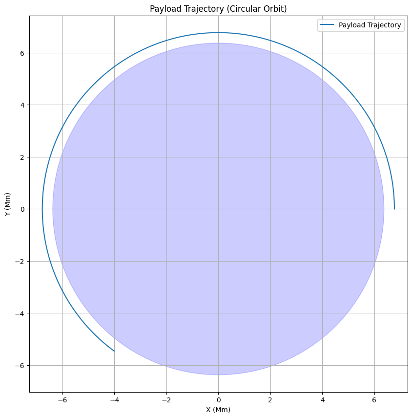
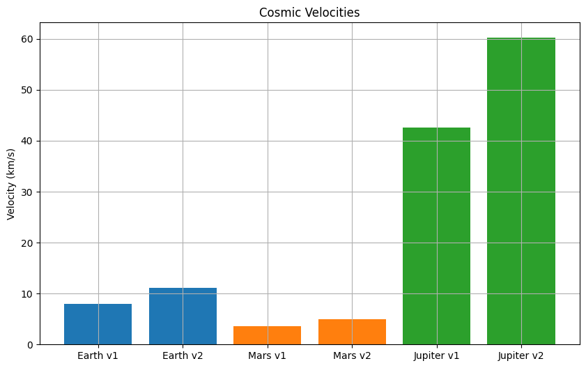

# Problem 1
Orbital Period and Orbital Radius

Motivation
Kepler’s Third Law relates the square of a planet’s orbital period ($T^2$) to the cube of its orbital radius ($r^3$), revealing the harmony of gravitational systems. This relationship is essential for astronomy and space mission planning, enabling calculations of masses and distances.

Derivation for Circular Orbits
For a body in a circular orbit around a central mass $M$ (e.g., a planet around the Sun), the gravitational force provides the centripetal force:

$\frac{G M m}{r^2} = \frac{m v^2}{r}$

Where:

$G$: Gravitational constant ($6.67430 \times 10^{-11}$ m³ kg⁻¹ s⁻²)
$M$: Mass of the central body (kg)
$m$: Mass of the orbiting body (kg)
$r$: Orbital radius (m)
$v$: Orbital velocity (m/s)
Simplify by canceling $m$ and multiplying through by $r$:

$\frac{G M}{r} = v^2$

The orbital velocity relates to the period $T$ via circumference:

$v = \frac{2\pi r}{T}$

Substitute into the force equation:

$\frac{G M}{r} = \left(\frac{2\pi r}{T}\right)^2 = \frac{4\pi^2 r^2}{T^2}$

Rearrange:

$\frac{G M}{r} = \frac{4\pi^2 r^2}{T^2}$

Multiply both sides by $T^2$ and divide by $r$:

$G M T^2 = 4\pi^2 r^3$

Thus:

$T^2 = \frac{4\pi^2}{G M} r^3$

This is Kepler’s Third Law for circular orbits, where $T^2 \propto r^3$, and the constant depends on $M$.

Implications in Astronomy
Mass Determination: Measure $T$ and $r$ of a satellite or moon to calculate $M$ of the central body.
Distance Calculation: Known $M$ and $T$ yield $r$, aiding in mapping planetary systems.
Real-World Examples
Moon around Earth: $T = 27.32$ days ($2.36 \times 10^6$ s), $r = 384,400$ km ($3.844 \times 10^8$ m), $M_{\text{Earth}} = 5.972 \times 10^{24}$ kg. Verify: $T^2 \approx 5.57 \times 10^{12}$ s², $r^3 \approx 5.68 \times 10^{25}$ m³, constant $\frac{4\pi^2}{G M} \approx 9.9 \times 10^{-14}$ s²/m³ matches.
Earth around Sun: $T = 1$ year ($3.156 \times 10^7$ s), $r = 1$ AU ($1.496 \times 10^{11}$ m), $M_{\text{Sun}} = 1.989 \times 10^{30}$ kg.
Extension to Elliptical Orbits
For elliptical orbits, replace $r$ with the semi-major axis $a$:

$T^2 = \frac{4\pi^2}{G M} a^3$

This holds universally per Kepler’s Third Law.

Problem 2: Escape Velocities and Cosmic Velocities
Motivation
Escape velocity defines the speed needed to break free from a gravitational field, while cosmic velocities extend this to orbiting and escaping larger systems, critical for space exploration.

Definitions and Derivations
First Cosmic Velocity (Orbital Velocity):
Speed for a circular orbit at radius $r$:

$v_1 = \sqrt{\frac{G M}{r}}$

Derived from balancing gravitational and centripetal forces.

Second Cosmic Velocity (Escape Velocity):
Speed to escape from radius $r$ to infinity:

Energy: $\frac{1}{2} m v^2 = \frac{G M m}{r}$

$v_2 = \sqrt{\frac{2 G M}{r}} = \sqrt{2} v_1$

Third Cosmic Velocity:
Speed to escape a star system (e.g., Earth escaping the Sun from its orbit). Approximate as escape from Sun’s field at 1 AU:

$v_3 = \sqrt{\frac{2 G M_{\text{Sun}}}{r_{\text{AU}}}} \approx 42.1$ km/s (from Earth’s orbit).

Adjusted for Earth’s motion: $v_3 \approx 16.6$ km/s relative to Earth.

Parameters
$M$: Mass of the body
$r$: Distance from center
$G$: Constant
Calculations
Earth: $M = 5.972 \times 10^{24}$ kg, $r = 6,371$ km:
$v_1 = 7.9$ km/s
$v_2 = 11.2$ km/s
Mars: $M = 6.417 \times 10^{23}$ kg, $r = 3,390$ km:
$v_1 = 3.6$ km/s
$v_2 = 5.0$ km/s
Jupiter: $M = 1.898 \times 10^{27}$ kg, $r = 69,911$ km:
$v_1 = 42.1$ km/s
$v_2 = 59.5$ km/s
Importance in Space Exploration
Satellites: $v_1$ for low Earth orbit (LEO).
Planetary Missions: $v_2$ to leave Earth; $v_3$ for solar system escape (e.g., Voyager).
Problem 3: Trajectories of a Freely Released Payload Near Earth
Motivation
A payload released from a rocket follows a trajectory shaped by initial velocity and Earth’s gravity, key to mission design.

Possible Trajectories
Elliptical: If $v < v_2$, orbits Earth.
Parabolic: If $v = v_2$, escapes to infinity with zero residual speed.
Hyperbolic: If $v > v_2$, escapes with excess speed.
Numerical Analysis
Use Newton’s gravitation: $\ddot{\mathbf{r}} = -\frac{G M}{r^3} \mathbf{r}$. Initial conditions: position $\mathbf{r}_0$, velocity $\mathbf{v}_0$, altitude $h$.

Explanations
Orbital Period: Log-log plot confirms $T^2 \propto r^3$.
Cosmic Velocities: Bar chart compares $v_1$ and $v_2$ across bodies.
Trajectory: Simulates a circular orbit; adjust $v_0$ for elliptical/hyperbolic paths.
Discussion
Elliptical Orbits: Kepler’s law adapts via semi-major axis.
Space Exploration: Velocities guide mission design.
Payload Trajectories: Initial conditions dictate orbit type, critical for deployment or reentry.