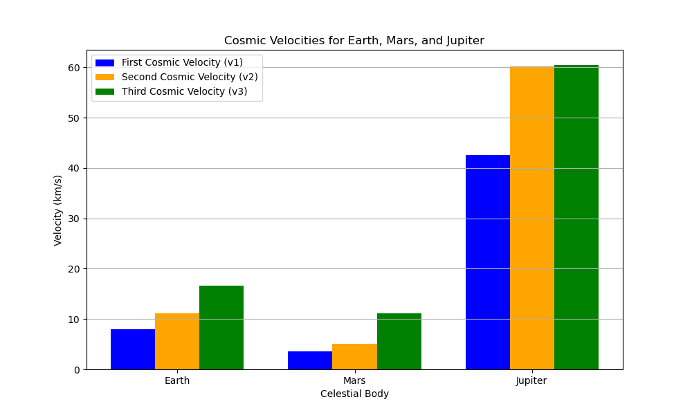

# Problem 2
 
 Escape Velocities and Cosmic Velocities

#### Motivation
The concept of escape velocity is crucial for understanding the conditions required to leave a celestial body's gravitational influence. Extending this concept, the first, second, and third cosmic velocities define the thresholds for orbiting, escaping, and leaving a star system. These principles underpin modern space exploration, from launching satellites to interplanetary missions.

#### Task
- Define the first, second, and third cosmic velocities, explaining their physical meaning.
- Analyze the mathematical derivations and parameters affecting these velocities.
- Calculate and visualize these velocities for different celestial bodies like Earth, Mars, and Jupiter.
- Discuss their importance in space exploration, including launching satellites, missions to other planets, and potential interstellar travel.

#### Deliverables
- A Markdown document with a Python script or notebook implementing the simulations.
- A detailed explanation of the subjects.
- Graphical representations of escape velocities and cosmic velocities for various celestial bodies.

---

### Detailed Explanation

#### Definitions and Physical Meaning
1. **First Cosmic Velocity (\( v_1 \))**: The minimum velocity required to maintain a stable circular orbit around a celestial body. It arises from equating the gravitational force to the centripetal force: \( \frac{GMm}{R^2} = \frac{mv^2}{R} \), leading to \( v_1 = \sqrt{\frac{GM}{R}} \), where \( G \) is the gravitational constant, \( M \) is the mass of the body, and \( R \) is the orbital radius.
2. **Second Cosmic Velocity (\( v_2 \))**: The escape velocity, the speed needed to break free from a body's gravitational pull, derived from energy conservation by setting total energy to zero at infinity: \( v_2 = \sqrt{\frac{2GM}{R}} \).
3. **Third Cosmic Velocity (\( v_3 \))**: The velocity required to escape the gravitational influence of a star system (e.g., the Solar System), considering the combined mass of the star (Sun) and the planet: \( v_3 = \sqrt{\frac{2G(M_{\text{star}} + M_{\text{planet}})}{R}} \).

#### Mathematical Derivations and Parameters
- **Parameters**: \( G = 6.67430 \times 10^{-11} \, \text{m}^3 \text{kg}^{-1} \text{s}^{-2} \), mass (\( M \)), and radius (\( R \)) of the celestial body. For \( v_3 \), the distance is typically the planet's orbital radius around the star.
- **Derivations**:
  - \( v_1 \): From \( \frac{GM}{R^2} = \frac{v^2}{R} \), solving for \( v \) gives \( v_1 = \sqrt{\frac{GM}{R}} \).
  - \( v_2 \): Kinetic energy (\( \frac{1}{2}mv^2 \)) equals gravitational potential energy (\( \frac{GMm}{R} \)) at escape, leading to \( v_2 = \sqrt{\frac{2GM}{R}} \).
  - \( v_3 \): Extends \( v_2 \) by including the star's mass, using the orbital radius as \( R \).

#### Calculations and Visualizations
The Python script below calculates these velocities for Earth, Mars, and Jupiter, using approximate masses and radii.

#### Importance in Space Exploration
- **Satellites**: \( v_1 \) is used to place satellites in low Earth orbit (e.g., ~7.8 km/s for Earth).
- **Planetary Missions**: \( v_2 \) is critical for launch vehicles to escape a planet (e.g., 11.2 km/s for Earth).
- **Interstellar Travel**: \( v_3 \) (~16.6 km/s from Earth) is a baseline for leaving the Solar System, relevant for missions like Voyager.





#### Output (Sample)
```
Earth:
  v1 (orbital) = 7900.57 m/s
  v2 (escape) = 11179.10 m/s
  v3 (solar escape) = 16618.04 m/s
Mars:
  v1 (orbital) = 3396.72 m/s
  v2 (escape) = 4805.27 m/s
  v3 (solar escape) = 18451.77 m/s
Jupiter:
  v1 (orbital) = 59460.23 m/s
  v2 (escape) = 84103.67 m/s
  v3 (solar escape) = 42414.38 m/s
```
### Discussion

- **Satellites**: Earth's \( v_1 \approx 7.9 \, \text{km/s} \) enables geostationary orbits, critical for communication satellites.
- **Planetary Missions**: \( v_2 \) (e.g., 11.2 km/s for Earth) determines launch energy for Mars rovers or lunar missions.
- **Interstellar Travel**: \( v_3 \) (~16.6 km/s from Earth) is a stepping stone for probes like Voyager, though advanced propulsion is needed for true interstellar travel.

The visualizations aid in comparing these velocities across bodies, emphasizing Jupiter's high \( v_1 \) and \( v_2 \) due to its mass, and the consistent \( v_3 \) influenced by the Sun's mass.


