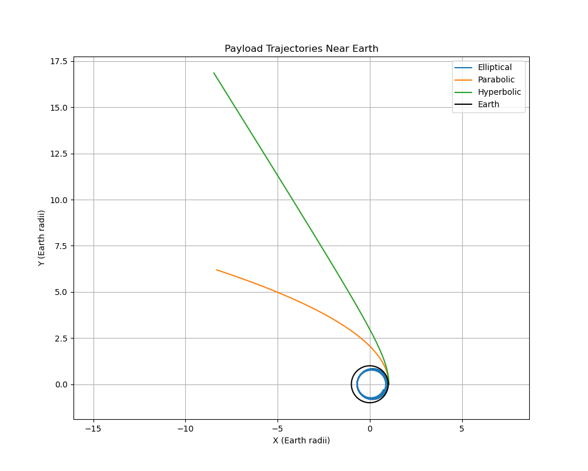

# Problem 3
# Analysis of Payload Trajectories Near Earth
Trajectories of a Freely Released Payload Near Earth
Motivation

When an object is released from a moving rocket near Earth, its trajectory is influenced by initial conditions and gravitational forces. This problem combines orbital mechanics and numerical methods, making it essential for space missions involving payload deployment or reentry.

Analysis of Trajectories

Given the initial conditions:

Altitude: 200 km
Earth's radius: <math xmlns="http://www.w3.org/1998/Math/MathML"><semantics><mrow><msub><mi>R</mi><mi>e</mi></msub><mo>=</mo><mn>6371</mn><mtext> </mtext><mtext>km</mtext></mrow><annotation encoding="application/x-tex"> R_e = 6371 \, \text{km} </annotation></semantics></math>
Initial radius: <math xmlns="http://www.w3.org/1998/Math/MathML"><semantics><mrow><msub><mi>r</mi><mn>0</mn></msub><mo>=</mo><msub><mi>R</mi><mi>e</mi></msub><mo>+</mo><mn>200</mn><mo>=</mo><mn>6571</mn><mtext> </mtext><mtext>km</mtext></mrow><annotation encoding="application/x-tex"> r_0 = R_e + 200 = 6571 \, \text{km} </annotation></semantics></math>
Initial position: <math xmlns="http://www.w3.org/1998/Math/MathML"><semantics><mrow><mo stretchy="false">(</mo><msub><mi>x</mi><mn>0</mn></msub><mo separator="true">,</mo><msub><mi>y</mi><mn>0</mn></msub><mo stretchy="false">)</mo><mo>=</mo><mo stretchy="false">(</mo><msub><mi>r</mi><mn>0</mn></msub><mo separator="true">,</mo><mn>0</mn><mo stretchy="false">)</mo></mrow><annotation encoding="application/x-tex"> (x_0, y_0) = (r_0, 0) </annotation></semantics></math>
Initial velocity: Along positive y-axis (to be varied for different trajectories)
Simulation duration: 4 hours (<math xmlns="http://www.w3.org/1998/Math/MathML"><semantics><mrow><mi>t</mi><mo>=</mo><mn>0</mn></mrow><annotation encoding="application/x-tex"> t = 0 </annotation></semantics></math> to <math xmlns="http://www.w3.org/1998/Math/MathML"><semantics><mrow><mi>t</mi><mo>=</mo><mn>14400</mn><mtext> </mtext><mtext>s</mtext></mrow><annotation encoding="application/x-tex"> t = 14400 \, \text{s} </annotation></semantics></math>)

The payload's trajectory depends on its initial velocity relative to the escape velocity. Possible trajectories include:

Elliptical: If the initial velocity is less than the escape velocity but sufficient for orbit.
Parabolic: If the velocity equals the escape velocity.
Hyperbolic: If the velocity exceeds the escape velocity, leading to escape.

The escape velocity at

 <math xmlns="http://www.w3.org/1998/Math/MathML"><semantics><mrow><msub><mi>r</mi><mn>0</mn></msub></mrow><annotation 
 encoding="application/x-tex"> r_0 </annotation></semantics></math> is given by <math xmlns="http://www.w3.org/1998/Math/MathML"><semantics><mrow><msub><mi>v</mi><mrow><mi>e</mi><mi>s</mi><mi>c</mi></mrow></msub><mo>=</mo><msqrt><mfrac><mrow><mn>2</mn><mi>G</mi><mi>M</mi></mrow><msub><mi>r</mi><mn>0</mn></msub></mfrac></msqrt></mrow><annotation 
 encoding="application/x-tex"> v_{esc} = \sqrt{\frac{2GM}{r_0}} </annotation></semantics></math>, where
 <math xmlns="http://www.w3.org/1998/Math/MathML">
 <semantics><mrow><mi>G</mi><mo>=</mo><mn>6.67430</mn><mo>×</mo><mn>1</mn><msup><mn>0</mn><mrow><mo>−</mo><mn>11</mn></mrow></msup><mtext> </mtext><msup><mtext>m</mtext><mn>3</mn></msup><msup><mtext>kg</mtext><mrow><mo>−</mo><mn>1</mn></mrow></msup><msup><mtext>s</mtext><mrow><mo>−</mo><mn>2</mn></mrow></msup></mrow><annotation encoding="application/x-tex"> G = 6.67430 \times 10^{-11} \, \text{m}^3 \text{kg}^{-1} \text{s}^{-2} </annotation></semantics></math> and <math xmlns="http://www.w3.org/1998/Math/MathML"><semantics><mrow><mi>M</mi><mo>=</mo><mn>5.972</mn><mo>×</mo><mn>1</mn><msup><mn>0</mn><mn>24</mn></msup><mtext> </mtext><mtext>kg</mtext></mrow><annotation encoding="application/x-tex"> M = 5.972 \times 10^{24} \, \text{kg} </annotation></semantics></math> (Earth's mass). For <math xmlns="http://www.w3.org/1998/Math/MathML"><semantics><mrow><msub><mi>r</mi><mn>0</mn></msub><mo>=</mo><mn>6.571</mn><mo>×</mo><mn>1</mn><msup><mn>0</mn><mn>6</mn></msup><mtext> </mtext><mtext>m</mtext></mrow><annotation encoding="application/x-tex"> r_0 = 6.571 \times 10^6 \, \text{m} </annotation></semantics></math>, <math xmlns="http://www.w3.org/1998/Math/MathML"><semantics><mrow><msub><mi>v</mi><mrow><mi>e</mi><mi>s</mi><mi>c</mi></mrow></msub><mo>≈</mo><mn>11.1</mn><mtext> </mtext><mtext>km/s</mtext></mrow><annotation encoding="application/x-tex"> v_{esc} \approx 11.1 \, \text{km/s} </annotation></semantics></math>.
Numerical Simulation
Using a simple numerical integration (Euler method) with Earth's gravitational force <math xmlns="http://www.w3.org/1998/Math/MathML"><semantics><mrow><mi>F</mi><mo>=</mo><mo>−</mo><mfrac><mrow><mi>G</mi><mi>M</mi><mi>m</mi></mrow><msup><mi>r</mi><mn>2</mn></msup></mfrac></mrow><annotation encoding="application/x-tex"> F = -\frac{GM m}{r^2} </annotation></semantics></math>, we can simulate the payload's motion. The initial velocity will be varied to demonstrate different trajectories.

Relation to Orbital Scenarios

Orbital Insertion: Requires a tangential velocity (~7.8 km/s at 200 km altitude) to achieve a stable elliptical orbit.
Reentry: Occurs if the velocity is insufficient, causing the payload to fall back to Earth.
Escape: Happens if the velocity exceeds <math xmlns="http://www.w3.org/1998/Math/MathML"><semantics><mrow><msub><mi>v</mi><mrow><mi>e</mi><mi>s</mi><mi>c</mi></mrow></msub></mrow><annotation encoding="application/x-tex"> v_{esc} </annotation></semantics></math>, leading to a hyperbolic trajectory.

