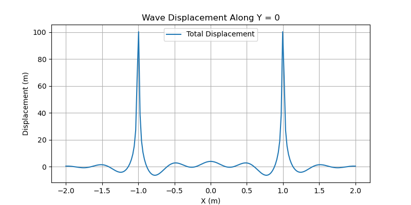
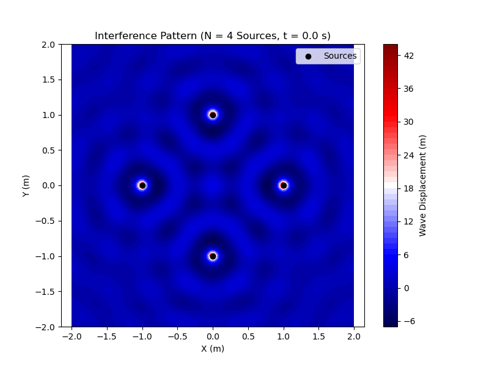

# Problem 1
# Interference Patterns on a Water Surface

## Introduction

This document analyzes the interference patterns formed on a water surface due to the superposition of waves emitted from point sources at the vertices of a regular polygon. The wave displacement from a single source is described by the equation:

\[ \eta(x, y, t) = \frac{A}{r} \cos(\omega t - kr + \phi) \]

where:
- \( \eta(x, y, t) \): Wave displacement at point \((x, y)\) and time \(t\),
- \( A \): Amplitude of the wave,
- \( r = \sqrt{(x - x_0)^2 + (y - y_0)^2} \): Distance from the source at \((x_0, y_0)\),
- \( \omega \): Angular frequency,
- \( k \): Wave number (related to wavelength \( \lambda \), where \( k = \frac{2\pi}{\lambda} \)),
- \( \phi \): Phase constant.

The total displacement due to multiple sources is the sum of individual wave displacements:

\[ \eta_{\text{sum}}(x, y, t) = \sum_{i=1}^N \eta_i(x, y, t) \]

where \( N \) is the number of sources. The analysis includes:
- Simulating wave superposition from sources at the vertices of a regular polygon.
- Visualizing interference patterns.
- Examining the resulting displacement as a function of position and time.
- Analyzing constructive and destructive interference.

A Python script is provided to simulate and visualize these patterns using libraries like NumPy and Matplotlib.

## Theoretical Background

### Wave Superposition
When multiple waves overlap, their displacements add algebraically due to the principle of superposition. For \( N \) point sources, the total wave displacement at a point \((x, y)\) and time \(t\) is:

\[ \eta_{\text{sum}}(x, y, t) = \sum_{i=1}^N \frac{A}{r_i} \cos(\omega t - k r_i + \phi_i) \]

where \( r_i = \sqrt{(x - x_i)^2 + (y - y_i)^2} \) is the distance from the \( i \)-th source at \((x_i, y_i)\), and \( \phi_i \) is the phase of the \( i \)-th source.

### Interference
- **Constructive Interference**: Occurs when waves are in phase (\( \Delta \phi = 2\pi n \), \( n \) integer), leading to larger amplitude.
- **Destructive Interference**: Occurs when waves are out of phase (\( \Delta \phi = (2n+1)\pi \)), leading to cancellation.
- The interference pattern depends on the relative positions of the sources, the wavelength \( \lambda \), and time \( t \).

### Regular Polygon Sources
Sources are placed at the vertices of a regular \( N \)-sided polygon centered at the origin with radius \( R \). The coordinates of the \( i \)-th vertex are:

\[ (x_i, y_i) = (R \cos\left(\frac{2\pi i}{N}\right), R \sin\left(\frac{2\pi i}{N}\right)) \]

for \( i = 0, 1, \ldots, N-1 \).

## Simulation and Analysis

### Setup
We simulate interference patterns for sources at the vertices of a regular polygon (e.g., triangle, square, pentagon). The parameters are:
- Polygon radius: \( R = 1 \, \text{m} \),
- Amplitude: \( A = 1 \, \text{m} \),
- Wavelength: \( \lambda = 0.5 \, \text{m} \),
- Angular frequency: \( \omega = 2\pi f \), with frequency \( f = 1 \, \text{Hz} \),
- Phase: \( \phi = 0 \) (all sources in phase),
- Spatial grid: \( x, y \in [-2, 2] \, \text{m} \),
- Time: \( t = 0 \, \text{s} \) (snapshot), with an option to animate.

## Results

### Interference Pattern
The script generates a contour plot (`interference_pattern.png`) showing the wave displacement for \( N = 4 \) sources (square configuration):
- Bright and dark regions indicate constructive and destructive interference, respectively.
- Symmetry reflects the regular arrangement of sources.
- The pattern radiates outward, with amplitude decreasing as \( 1/r \).

### Displacement Analysis
A line plot (`displacement_line.png`) along \( y = 0 \) shows the displacement \( \eta_{\text{sum}}(x, 0, t) \):
- Peaks and troughs highlight interference effects.
- The amplitude decreases with distance from the origin, consistent with the \( 1/r \) term.

### Time Dependence
At \( t = 0 \), the pattern is a snapshot. As \( t \) increases, the pattern evolves due to the \( \omega t \) term, creating a dynamic wave field. This can be visualized by animating the plot (not implemented here but possible with Matplotlib’s animation tools).

## Discussion

### Interference Patterns
- **Constructive Interference**: Occurs where path differences are integer multiples of \( \lambda \), leading to amplified waves.
- **Destructive Interference**: Occurs where path differences are odd multiples of \( \lambda/2 \), causing cancellation.
- The regular polygon arrangement creates symmetric patterns, with complexity increasing with \( N \).

### Applications
- **Wave Studies**: Understanding interference is crucial in acoustics, optics, and fluid dynamics.
- **Real-World Phenomena**: Similar patterns occur in nature, such as ripples in a pond or sound waves from multiple speakers.
- **Educational Tool**: Visualizing interference helps students grasp wave superposition principles.

### Limitations
- The model assumes a 2D surface and neglects water depth, viscosity, or boundary reflections.
- Sources are idealized as points with constant amplitude and phase.
- The simulation is static (\( t = 0 \)); a full animation would better capture wave dynamics.

## Conclusion
This analysis demonstrates how interference patterns form on a water surface due to multiple point sources. The Python script provides a clear visualization of these patterns, highlighting constructive and destructive interference. The regular polygon arrangement creates symmetric, radiating patterns, offering insights into wave behavior. Future work could include dynamic animations, 3D wave propagation, or additional physical effects like damping or reflection.

</xaiArtifact>