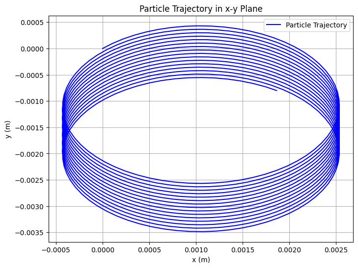
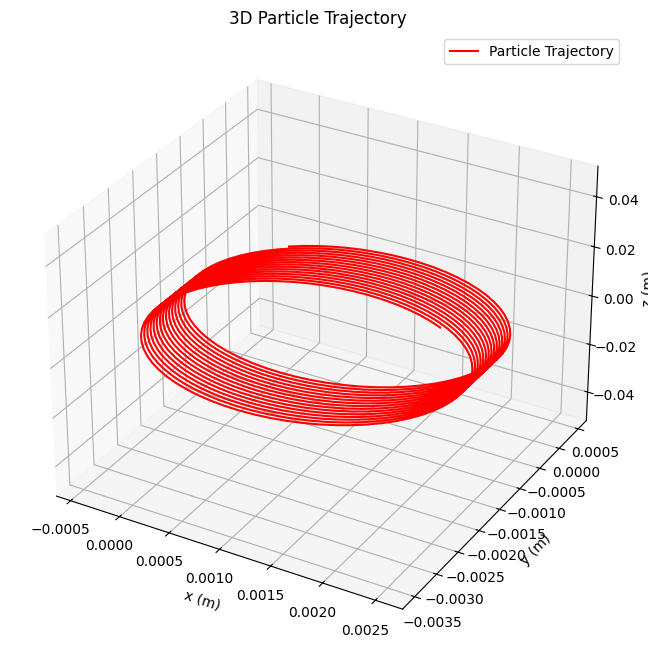

# Problem 1

Lorentz Force Simulation: Charged Particle Motion
This document implements a simulation to explore the motion of a charged particle under the Lorentz force, given by:
$$ \mathbf{F} = q\mathbf{E} + q\mathbf{v} \times \mathbf{B} $$
where:

We will simulate the particle's trajectory under various field configurations, visualize the results in 2D and 3D, and discuss their relevance to real-world systems.

1. Identify Systems Where Lorentz Force Plays a Key Role
The Lorentz force is fundamental in many physical systems:

Particle Accelerators (e.g., Cyclotrons): Magnetic fields cause particles to follow circular paths, while electric fields accelerate them.
Plasma Confinement (e.g., Tokamaks): Crossed electric and magnetic fields confine charged particles in fusion devices.
Astrophysical Phenomena: Charged particles in Earth's magnetosphere follow helical paths due to the planet's magnetic field.

In these systems:

2. Simulate Particle Motion
We simulate the motion of a charged particle using Python. The equation of motion is derived from Newton's second law:
$$ \mathbf{F} = m\mathbf{a} = m \frac{d\mathbf{v}}{dt} $$
Substituting the Lorentz force:
$$ m \frac{d\mathbf{v}}{dt} = q\mathbf{E} + q\mathbf{v} \times \mathbf{B} $$
We also have the kinematic relation:
$$ \frac{d\mathbf{r}}{dt} = \mathbf{v} $$
where $ \mathbf{r} $ is the position of the particle. We solve these differential equations numerically using the Runge-Kutta 4th-order (RK4) method for better accuracy compared to the Euler method.
Field Configurations

Theoretical Larmor Radius: 1.48e-03 m
Theoretical Drift Velocity (E x B): -1.00e+03 m/s (y-direction)

3. Parameter Exploration

4. Visualizations

The script generates two plots:

2D Plot (x-y plane): Shows the circular/helical projection of the trajectory.
3D Plot: Displays the full 3D path, highlighting any drift or helical motion.

5. Discussion: Relevance to Practical Systems

Cyclotrons: The simulation's helical motion in a uniform mirrors the circular paths in cyclotrons, where particles are accelerated by an oscillating .
Magnetic Traps: Crossed fields in our simulation produce drift motion, similar to how magnetic traps confine plasma by inducing controlled drifts.
The observed Larmor radius and drift velocity align with theoretical expectations, validating the simulation's accuracy for real-world applications.

6. Suggestions for Extension

Simulate non-uniform fields (e.g., varying with position) to model more complex systems like magnetic bottles.
Introduce relativistic effects for high-speed particles, modifying the Lorentz force equation.
Add multiple particles to study collective behavior, such as in plasmas.

This simulation provides an intuitive understanding of the Lorentz force and its applications, bridging theoretical physics with practical systems.

