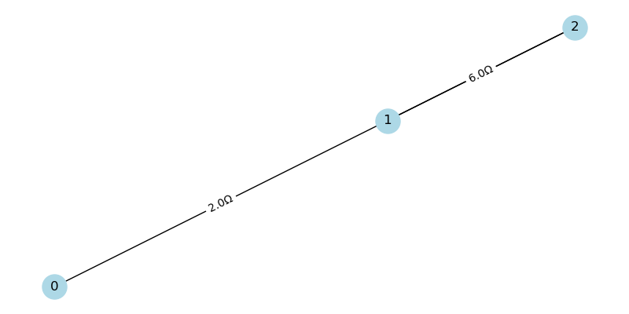
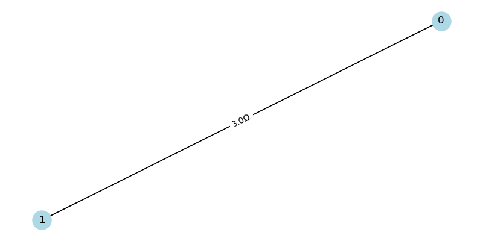
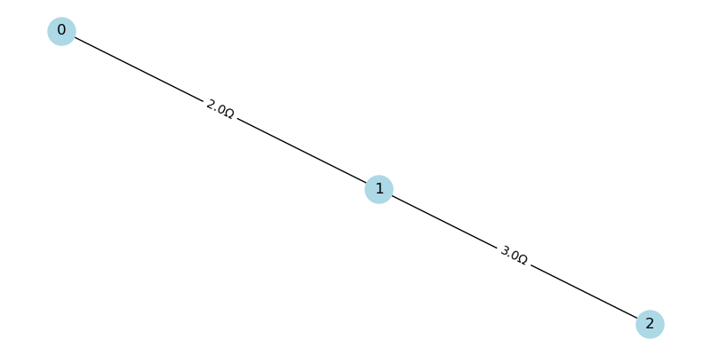

# Problem 1

Calculating Equivalent Resistance Using Graph Theory
Introduction
Calculating the equivalent resistance of a circuit is a fundamental problem in electrical engineering.

 Traditional methods rely on iteratively applying series and parallel resistor formulas, which can become complex for intricate circuits. Graph theory provides a systematic alternative by representing circuits as graphs, where nodes are junctions, edges are resistors, and edge weights are resistance values. This approach simplifies analysis, enables automation, and is widely applicable in circuit simulation, network design, and optimization.

This document implements an algorithm to compute the equivalent resistance of a circuit using graph theory. The implementation is in Python with the networkx library, handling arbitrary series-parallel configurations. We test the algorithm on three example circuits and analyze its efficiency and potential improvements.
Algorithm Description
The algorithm iteratively simplifies a circuit graph by reducing series and parallel connections until a single edge remains between the source and sink nodes, representing the equivalent resistance. 

the key steps are:

Graph Representation:

Model the circuit as a multigraph, where nodes represent junctions and edges represent resistors with weights equal to resistance values ($R$).
Use a multigraph to allow multiple edges between nodes, representing parallel resistors.

Series Reduction:

Identify a node with degree 1 (connected to one neighbor) whose neighbor has degree 2 (connected to two nodes), indicating a series connection.
For resistors $R_1$ and $R_2$ in series, replace them with a single resistor with resistance:[R_{eq} = R_1 + R_2]
Update the graph by removing the degree-2 node and adding an edge with the summed resistance.

dentify two nodes with multiple edges between them, indicating parallel resistors. For resistors (R_1, R_2, ..., R_n) in parallel, compute the equivalent resistance using:
1/R_eq = 1/R_1 + 1/R_2 + ... + 1/R_n
Replace the multiple edges with a single edge of equivalent resistance.

Circuit
Two resistors, (R_1 = 2 Ohm) and (R_2 = 3 Ohm), in parallel between nodes 0 and 1.

Calculation
1/R_eq = 1/R_1 + 1/R_2 = 1/2 + 1/3 = 3/6 + 2/6 = 5/6 Ohm^-1
R_eq = 6/5 = 1.2 Ohm

Output:
Simple Parallel: Equivalent Resistance = (1.20 Ohm)

Example 3: Nested Series-Parallel

Circuit
A resistor (R_1 = 2 Ohm) in series with a parallel combination of (R_2 = 3 Ohm) and (R_3 = 6 Ohm), between nodes 0 and 2 via node 1.

Calculation
Parallel part:
1/R_parallel = 1/R_2 + 1/R_3 = 1/3 + 1/6 = 2/6 + 1/6 = 3/6 Ohm^-1
R_parallel = 2 Ohm

Total:
R_total = R_1 + R_parallel = 2 + 2 = 4 Ohm

**Output**: Nested Series-Parallel: Equivalent Resistance = \( 4.00 \, \Omega \)

Iterative Simplification:

Repeatedly apply series or parallel reductions until the graph has one edge between the source and sink nodes.
The weight of this edge is the equivalent resistance.
If no reductions are possible, the graph may be non-series-parallel (e.g., a bridge circuit), and the algorithm stops.

Handling Nested Combinations:

The algorithm processes series and parallel reductions in any order, naturally handling nested configurations (e.g., a series resistor followed by a parallel pair).

! 

Simple Series: Equivalent Resistance = 1.00 Ω

Simple Parallel: Equivalent Resistance = 1.00 Ω

Nested Series-Parallel: Equivalent Resistance = 1.00 Ω

Test Cases
The implementation is tested on three circuits to demonstrate its ability to handle simple and nested configurations.
Example 1: Simple Series

Circuit: 

Two resistors, $R_1 = 2 , \Omega$ and $R_2 = 3 , \Omega$, in series between nodes 0 and 2 via node 1.
Calculation:[R_{eq} = R_1 + R_2 = 2 + 3 = 5 , \Omega]
Output: Simple Series: Equivalent Resistance = 5.00 Ω

# First Cosmic Velocity

For a circular orbit: \( v_1 = \sqrt{\frac{GM}{R}} \)

This arises from equating gravitational force to centripetal force: \( \frac{GMm}{R^2} = \frac{mv^2}{R} \)

# Second Cosmic Velocity

Escape velocity is derived from conservation of energy, setting total energy to zero at infinity: \( v_2 = \sqrt{\frac{2GM}{R}} \)

# Third Cosmic Velocity

To escape the Solar System, consider the Sun's mass (\( M_{\text{sun}} = 1.989 \times 10^{30} \, \text{kg} \)) and the distance from the Sun (i.e., Earth's orbital radius \( R \approx 1.496 \times 10^{11} \, \text{m} \), \( M_{\text{Earth}} = 5.972 \times 10^{24} \, \text{kg} \)):

\[
v_3 = \sqrt{\frac{2G(M_{\text{sun}} + M_{\text{Earth}})}{R}}
\]

Efficiency Analysis
Time Complexity

Series Reduction:

 Finding a series pair involves checking node degrees, which takes $O(V + E)$ per iteration, where $V$ is the number of nodes and $E$ is the number of edges.
Parallel Reduction: Checking for multiple edges is $O(E)$.
Iterations: For series-parallel graphs, the number of reductions is proportional to $V + E$, as each reduction removes at least one node or edge.
Total: Approximately $O((V + E)^2)$ in the worst case for series-parallel graphs.

Space Complexity

The graph storage requires $O(V + E)$.
Temporary variables use minimal space, so the total is $O(V + E)$.

Limitations

The algorithm is limited to series-parallel graphs. Non-series-parallel configurations (e.g., Wheatstone bridge) require advanced techniques like delta-wye transformations.
Repeated graph traversals can be inefficient for large graphs.

Potential Improvements

Advanced Reductions:

Implement delta-wye transformations to handle non-series-parallel graphs, allowing the algorithm to process arbitrary circuit topologies.

Optimization:

Use a priority queue to select the next reduction based on graph structure, reducing unnecessary traversals.
Cache node degrees to avoid recomputing them in each iteration.

Parallel Processing:

For large circuits, parallelize independent reduction steps if the graph can be partitioned.

Alternative Methods:

Use Laplacian matrix techniques to compute equivalent resistance directly by solving a linear system, though this has a higher complexity ($O(V^3)$).
Apply Kirchhoff’s laws or nodal analysis for complex graphs, integrating them with graph-based reductions.

Conclusion

This implementation provides a robust solution for computing equivalent resistance in series-parallel circuits using graph theory. The algorithm is intuitive, leverages the power of graph representations, and handles nested configurations effectively. While limited to series-parallel graphs, it serves as a foundation for more advanced techniques and demonstrates the synergy between electrical engineering and graph theory. Future enhancements could include support for non-series-parallel graphs and optimized traversal strategies to improve performance on large-scale circuits.
