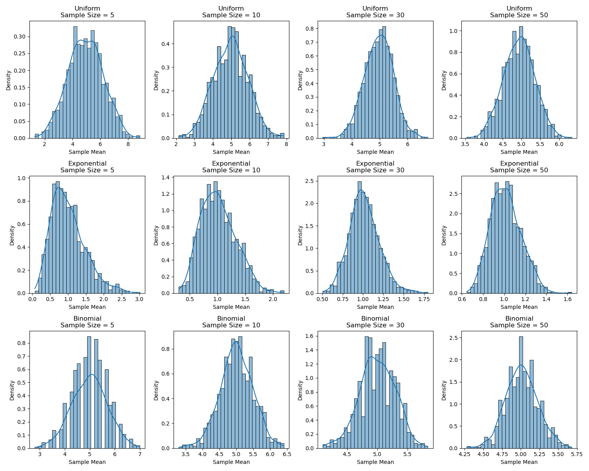

# Problem 1
1. Simulating Sampling Distributions

The Central Limit Theorem (CLT) states that the distribution of sample means approaches a normal distribution as the sample size increases, regardless of the population's distribution. We'll simulate this using three population distributions:

Uniform Distribution: Range [0, 10].

Exponential Distribution: Rate parameter $\lambda = 1$.

Binomial Distribution: $n = 10$, $p = 0.5$.

For each, we generate a large population dataset (10,000 data points).

2. Sampling and Visualization

We randomly sample from each population, calculate the sample mean, and repeat this process 1,000 times for sample sizes of 5, 10, 30, and 50. We then plot histograms of the sample means to observe convergence to a normal distribution.

3. Implementation: Python Simulation

Below is a Python script that performs the simulation and visualization.

 import numpy as np import matplotlib.pyplot as plt import seaborn as sns

Results

Uniform Distribution: The sampling distribution approaches normality even at small sample sizes (e.g., 10), due to its symmetric nature.
Exponential Distribution: Being heavily skewed, it requires a larger sample size (e.g., 30) to approximate normality.
Binomial Distribution: With $p=0.5$, it’s symmetric, so convergence is faster, similar to the uniform case.

4. Parameter Exploration

Shape and Sample Size
Shape: Skewed distributions (e.g., exponential) converge more slowly to normality than symmetric ones (e.g., uniform, binomial).
Sample Size: Larger sample sizes (e.g., 50) consistently produce bell-shaped distributions, confirming the CLT.
Impact of Variance
The variance of the sampling distribution is given by $\sigma^2/n$, where $\sigma^2$ is the population variance and $n$ is the sample size:

Uniform: Variance = $\frac{(10-0)^2}{12} = 8.33$; spread decreases as $n$ increases.
Exponential: Variance = $1/\lambda^2 = 1$; larger sample sizes reduce the spread.
Binomial: Variance = $np(1-p) = 10 \cdot 0.5 \cdot 0.5 = 2.5$; smaller variance leads to a tighter sampling distribution.
5. Practical Applications
Estimating Population Parameters: CLT allows us to use sample means to estimate population means with confidence intervals.
Quality Control: In manufacturing, sample means of product measurements are assumed normal to set control limits.
Financial Models: CLT helps model aggregate returns or losses as normal, aiding in risk prediction.
6. Discussion
The simulations align with the CLT: as sample size increases, the sampling distribution of the mean becomes normal, regardless of the population distribution. However, convergence rates depend on the population's shape and variance. Limitations include finite simulation runs, which may not fully capture extreme behaviors.

    # Plot histogram with KDE
    plt.subplot(len(populations), len(sample_sizes), plot_idx)
    sns.histplot(sample_means, bins=30, kde=True, stat='density')
    plt.title(f'{dist_name}\nSample Size = {sample_size}')
    plt.xlabel('Sample Mean')
    plt.ylabel('Density')
    plt.tight_layout()
    plot_idx += 1
